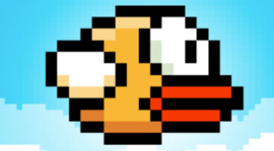

# Flappy Bird - A Classic Reimagined

A simple, yet addictive, implementation of the classic Flappy Bird game using HTML, CSS, and JavaScript. Dodge the pipes and achieve the highest score!



## Description

This project recreates the iconic Flappy Bird game within a web browser. Using standard web technologies (HTML for structure, CSS for styling, and JavaScript for logic), the game features dynamically generated pipes, score tracking, and collision detection.  The aim of the game is simple: tap the screen to make the bird flap and navigate through the gaps between the pipes without colliding.

This implementation showcases:

*   **Simple Game Logic:** Clean and understandable JavaScript code for game mechanics.
*   **Dynamic Pipe Generation:** Pipes are randomly generated to increase difficulty.
*   **Collision Detection:**  Accurate collision detection for a fair gameplay experience.
*   **Responsive Design:** The game scales reasonably across different screen sizes. (Further improvements possible!)

## Table of Contents

*   [Description](#description)
*   [Usage](#usage)
*   [Contributing](#contributing)

## Usage

Simply open the `index.html` file in your web browser to play the game.

1.  Download or clone the repository:

    ```bash
    git clone https://github.com/YOUR_USERNAME/YOUR_REPOSITORY.git
    cd YOUR_REPOSITORY
    ```

2.  Open `index.html` in your browser.
3.  Tap or click to make the bird fly.
4.  Avoid the pipes!

## Contributing

We welcome contributions!  Here's how you can help:

1.  Fork the repository.
2.  Create a new branch for your feature or bug fix.
3.  Make your changes.
4.  Commit your changes with clear and concise messages.
5.  Push your changes to your forked repository.
6.  Submit a pull request.

Please ensure your code adheres to the existing style and conventions. While this project doesn't currently have automated tests, consider adding tests if you introduce significant new functionality.
